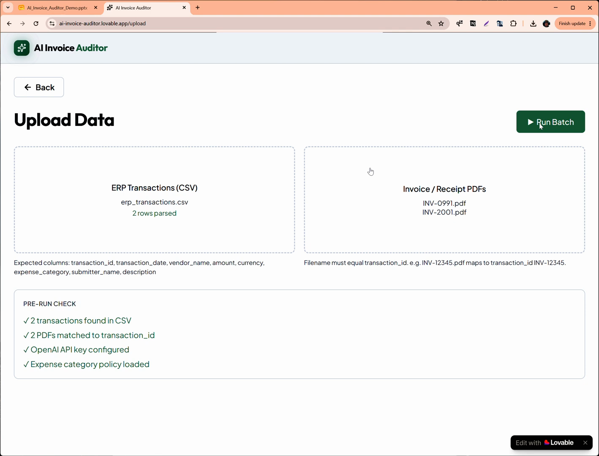
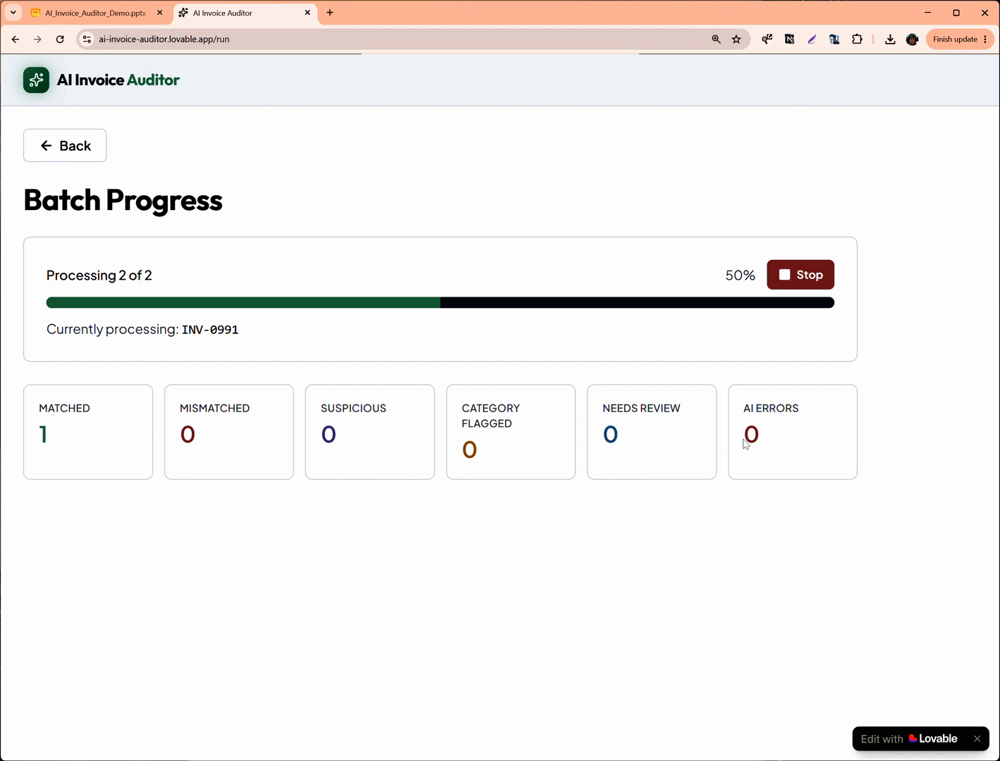
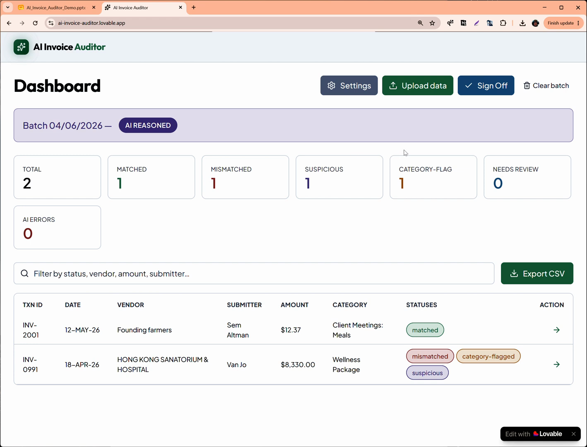
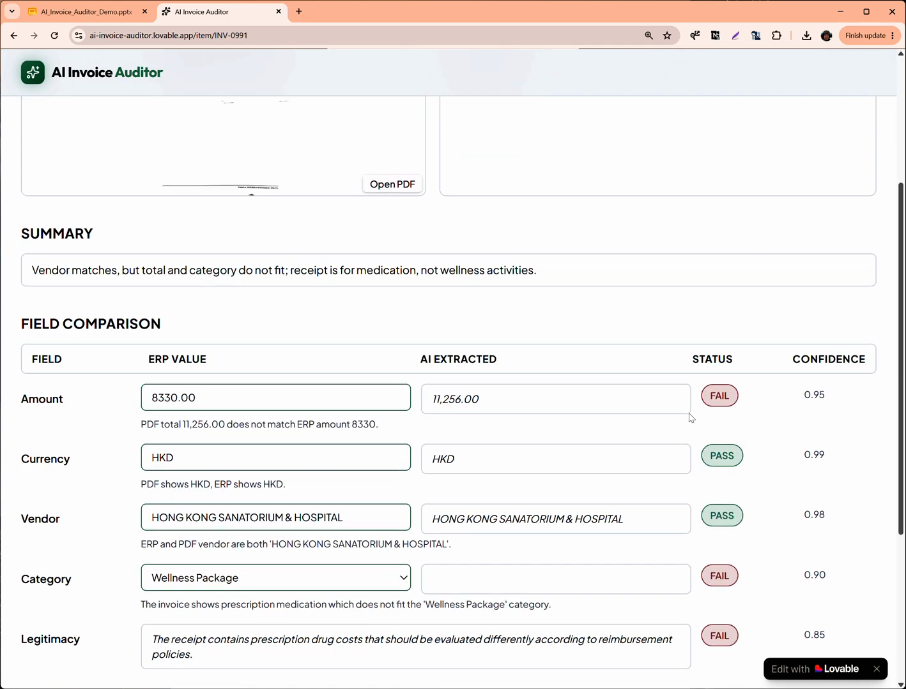

# AI 发票审计：核心页面说明

这些页面截取自 Product Faculty 公开项目的产品演示视频，用于理解产品交互和方案结构，不是重新绘制的高保真原型。

来源：[AI Invoice Auditor 项目页](https://cohort-projects.pages.dev/projects/ai-invoice-auditor/)

## 01 上传数据与运行前检查

- 用户同时上传 ERP 交易 CSV 和发票／收据 PDF。
- 系统先检查交易数量、文件匹配关系、模型配置和费用政策是否就绪。
- 产品价值：把输入质量问题挡在批量执行之前，避免“运行完成后才发现数据不可用”。

视频时间：约 01:34。

## 02 批次审计处理进度

- 展示当前处理对象、整体进度和实时分类统计。
- 支持停止批次，避免黑箱式长任务无法干预。
- 产品价值：让异步 AI 任务具备可见状态和可控性。

视频时间：约 01:55。

## 03 批次审计仪表盘

- 汇总匹配、不匹配、可疑、费用类别异常、待人工复核和 AI 错误。
- 下方保留逐笔交易及多标签状态，可筛选、查看详情、导出和签字确认。
- 产品价值：AI 不直接替代审核人，而是先完成批量分流和风险排序。

视频时间：约 02:57。

## 04 发票详情与字段核验

- 并排展示 ERP 值、AI 从票据中提取的值、校验结果和置信度。
- 除金额、币种、供应商等结构化字段外，还判断费用类别与票据真实性风险。
- 每个判断提供解释，方便审核人纠错和作出最终决定。

视频时间：约 02:15。

## 产品主链路

上传数据 → 运行前检查 → 批量处理 → 风险仪表盘 → 单据核验 → 人工签字／导出。
