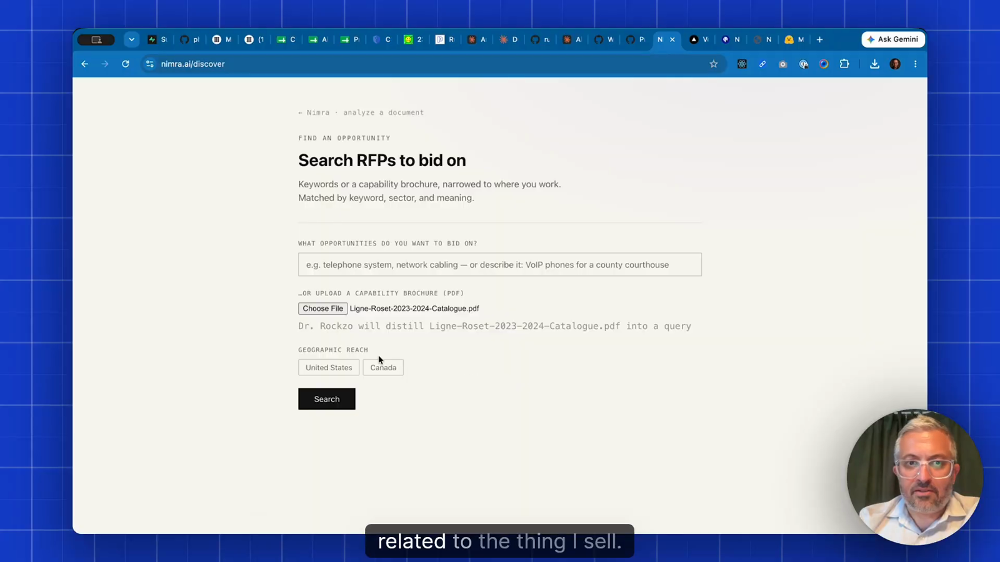
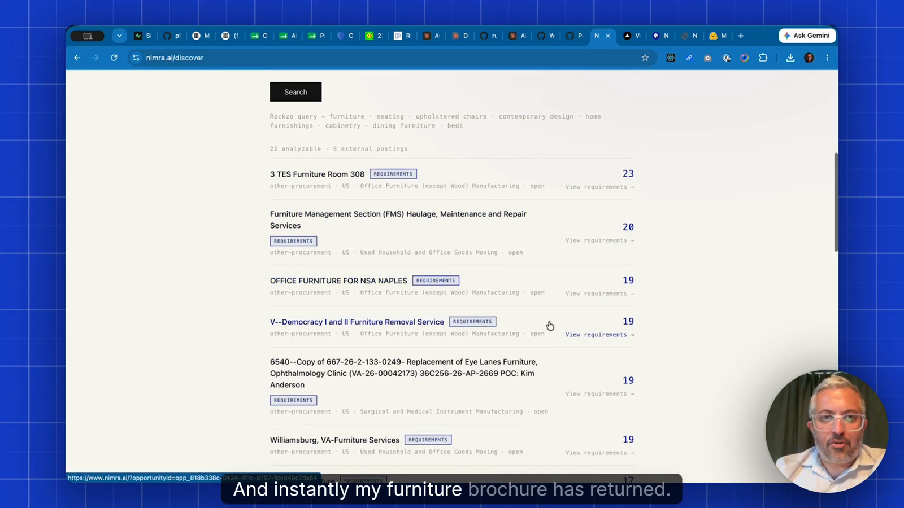
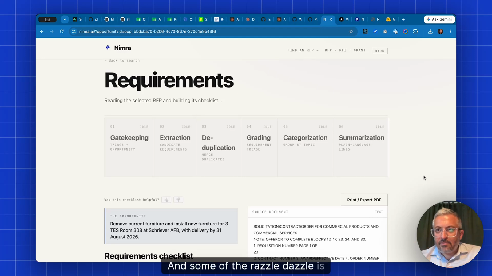
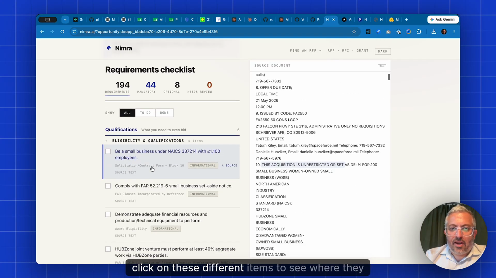

# Nimra AI：核心页面说明

这些页面截取自 Product Faculty 公开项目的产品演示视频，用于理解产品交互和方案结构，不是重新绘制的高保真原型。

来源：[Nimra AI 项目页](https://cohort-projects.pages.dev/projects/nimra-ai/)

## 01 招标机会搜索与能力资料上传

- 用户可以直接描述想找的招标机会，也可以上传企业能力手册。
- AI 将非结构化能力资料转成搜索条件，并结合地域范围进行检索。
- 产品价值：用户不必先掌握复杂的招标分类和关键词体系。

视频时间：约 02:12。

## 02 匹配招标机会列表

- 系统返回与企业能力相关的招标机会列表。
- 每个机会直接显示已识别的需求数量，并提供进入需求详情的入口。
- 产品价值：不是只做“搜索”，而是提前告诉用户后续阅读和响应的工作量。

视频时间：约 02:22。

## 03 多 Agent 需求解析进度

- 将长篇 RFP 的处理拆分为准入判断、需求抽取、去重、分级、分类和摘要。
- 每个步骤在界面中有明确状态，完成后生成可执行的需求清单。
- 产品价值：把后台 Agent 编排转化为用户可理解的任务进度，而不是只显示一个加载动画。

视频时间：约 02:31。

## 04 需求清单与原文证据对照

- 左侧是结构化需求清单，按资格、强制、可选和待复核进行分类统计。
- 右侧保留原始 RFP 文本，点击需求可定位或查看对应证据。
- 产品价值：既提高文档阅读效率，又保留可追溯性，便于人工确认和后续撰写响应文件。

视频时间：约 02:41。

## 产品主链路

输入企业能力 → 搜索匹配机会 → 选择 RFP → 多 Agent 解析 → 分类需求清单 → 原文证据核验 → 导出响应清单。
