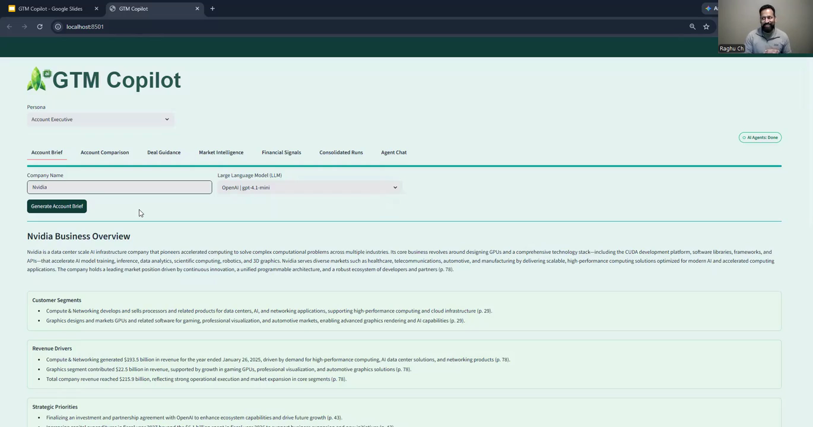
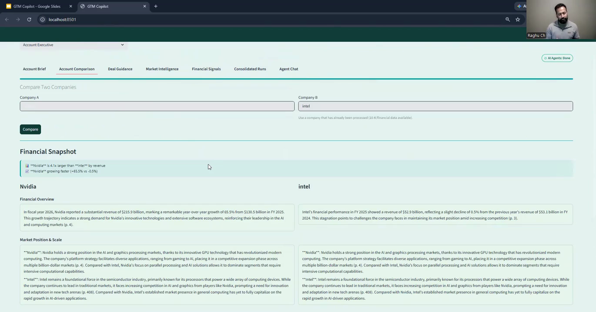
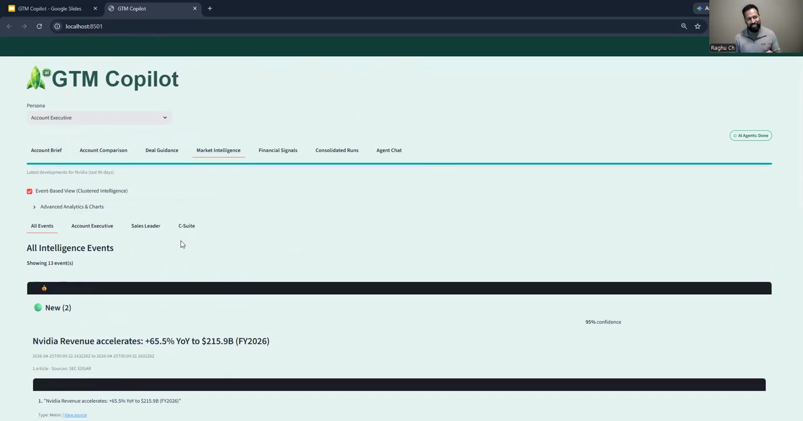
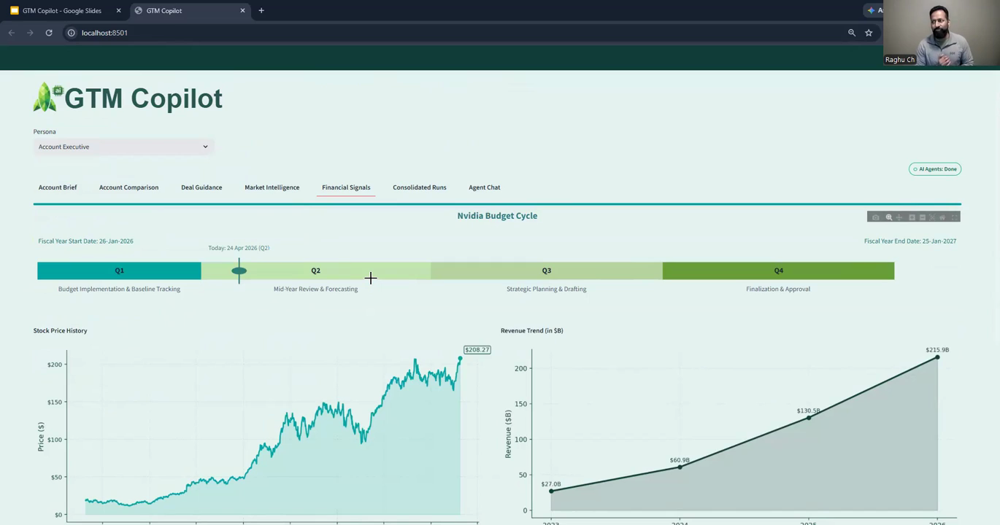

# GTM Copilot：核心页面说明

这些页面截取自 Product Faculty 公开项目的产品演示视频，用于理解产品交互和方案结构，不是重新绘制的高保真原型。

来源：[GTM Copilot 项目页](https://cohort-projects.pages.dev/projects/gtm-copilot/)

## 01 客户账户简报

- 销售输入目标公司并选择模型，一键生成客户账户简报。
- 输出包括公司概况、客户分群、收入驱动因素、战略重点、创新方向、风险和运营挑战。
- 每条信息保留页码或来源线索，便于销售在会前快速核验。

视频时间：约 02:22。

## 02 客户与竞品对比

- 将两个目标公司放在同一结构中进行财务、市场位置和规模对比。
- 顶部先给出销售可直接使用的差异结论，下方保留支撑信息。
- 产品价值：把“公司研究”转化为销售判断，而不是堆砌公司资料。

视频时间：约 02:57。

## 03 市场情报与证据置信度

- 聚合目标公司近期收入、并购、产品和管理层事件。
- 允许按销售角色筛选，并展示来源、证据和置信度。
- 产品价值：将新闻监控进一步变成可核验、可用于客户沟通的事件情报。

视频时间：约 03:56。

## 04 财务信号与预算周期

- 将财年预算周期、股价历史和收入趋势放在同一页面。
- 预算阶段帮助销售判断接触、规划和审批的时间窗口。
- 产品价值：把财务数据转化为销售时机信号，而不是单纯展示走势图。

视频时间：约 04:08。

## 产品主链路

输入目标客户 → 生成账户简报 → 竞品／客户对比 → 监控市场事件 → 识别财务与预算信号 → 形成会前策略和下一步行动。
